# Chart Types

This section describes each chart type supported by ParaCharts, grouped by family. For each, you'll find a description, typical use cases, structure, and example images.

# Chart Type Families

## Bar and Column Charts

Bar charts and column charts are foundational tools for comparing quantities across categories. In a bar chart, the bars are oriented horizontally, making them ideal for categorical data with longer labels or when you want to emphasize category names. Column charts, on the other hand, display bars vertically and are often used for time series or ordinal data, where the progression along the x-axis is meaningful.

Both chart types support multiple data series, stacking, and clustering. The x-axis typically represents categories (for bar charts) or time/ordinal values (for column charts), while the y-axis shows the corresponding values. These charts are highly effective for visualizing discrete comparisons and trends.

<figure>
	
	<figcaption>Bar chart: horizontal bars for comparing categories.</figcaption>
</figure>

<figure>
	
	<figcaption>Column chart: vertical bars for time series or ordinal data.</figcaption>
</figure>

---

## Line Charts

Line charts are designed to show trends and changes over time or across ordered categories. Each data point is connected by a line, making it easy to observe patterns, fluctuations, and overall direction in the data. Line charts are especially useful for continuous data and for highlighting the relationship between variables over a sequence.

Multiple series can be displayed on the same chart, allowing for direct comparison of different datasets. The x-axis usually represents time or an ordered sequence, while the y-axis displays the measured values.

<figure>
	
	<figcaption>Line chart: trends and changes over time or ordered categories.</figcaption>
</figure>

---

## Pie and Donut Charts

Pie charts provide a clear visual representation of proportions within a whole. Each slice corresponds to a category, with the size of the slice indicating its share of the total. Donut charts are a variation of pie charts, featuring a central hole that can be used for additional labeling or simply for stylistic purposes.

These charts are best used when you want to emphasize the relative sizes of parts to a whole, rather than precise values. Each segment is sized according to its value, making it easy to compare proportions at a glance.

<figure>
	
	<figcaption>Pie chart: proportions of a whole, each slice is a category.</figcaption>
</figure>

---

## Heatmaps

Heatmaps are powerful for visualizing data density, correlations, or distributions across two dimensions. Each cell in the matrix is colored according to its value, allowing users to quickly spot patterns, clusters, or outliers. The x and y axes represent categories or bins, while color intensity encodes the magnitude of the value.

Heatmaps are especially useful for large datasets where individual values are less important than overall trends or concentrations.
